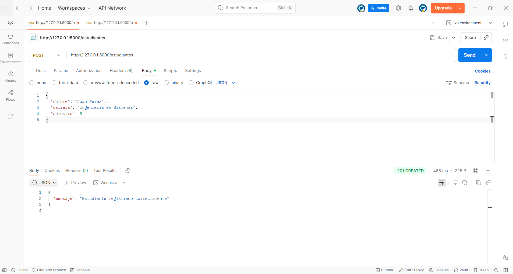
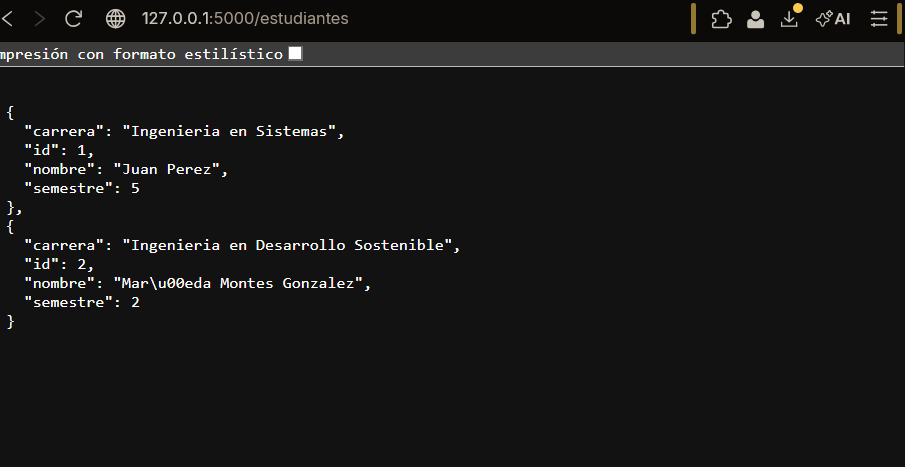
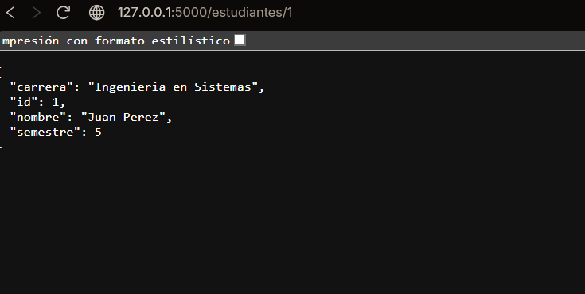

# **Registro de estudiantes en una base de datos mediante una API**

## Estructura del proyecto

```bash
api_estudiantes/
│
├── app.py
└── estudiantes.db   (se crea automáticamente)
└── images/
└──────────  Metodo_GET.png
└──────────  Metodo_POST.png
└── requirements.txt
```

## Explicación del código
### 1. Importación de librerías
```bash
from flask import Flask, request, jsonify
import sqlite3
```
**¿Qué hace cada importación?** 
+ Flask → crea la aplicación web.
+ request → permite leer datos enviados por el cliente (por ejemplo JSON en un POST).
+ jsonify → convierte datos de Python en respuesta JSON.
+ sqlite3 → permite conectar Python con una base de datos SQLite.

### 2. Crear la aplicación Flask
```bash
app = Flask(__name__)
```

**Aquí se crea la instancia de la aplicación.**  
+ __name__ indica a Flask dónde está el archivo principal.
+ Con app se configuran rutas, endpoints y ejecución del servidor.

### 3. Función para conectarse a la base de datos
```bash
def get_db_connection():
    conn = sqlite3.connect('estudiantes.db')
    conn.row_factory = sqlite3.Row
    return conn
```
**Esta función:**
1. Abre la base de datos estudiantes.db
2. Permite acceder a las columnas por nombre en lugar de índice 
3. Regresa la conexión.

**Ejemplo:**

Sin row_factory:
```bash
estudiante[1]
```

Con row_factory:
```bash
estudiante["nombre"]
```

Esto hace el código más claro y legible.

### 4. Crear la tabla si no existe
```bash
def crear_tabla():
    conn = get_db_connection()
```

Se abre una conexión a la base de datos.
```bash
conn.execute('''
    CREATE TABLE IF NOT EXISTS estudiantes (
        id INTEGER PRIMARY KEY AUTOINCREMENT,
        nombre TEXT NOT NULL,
        carrera TEXT NOT NULL,
        semestre INTEGER NOT NULL
    )
''')
```
**Aquí se ejecuta SQL.**

**Explicación de la tabla**
```bash
| Campo    | Tipo    | Descripción            |
| -------- | ------- | ---------------------- |
| id       | INTEGER | identificador único    |
| nombre   | TEXT    | nombre del estudiante  |
| carrera  | TEXT    | carrera del estudiante |
| semestre | INTEGER | semestre actual        |
```

`AUTOINCREMENT` → el id se genera automáticamente.

`IF NOT EXISTS` → evita error si la tabla ya existe.
```
conn.commit()
conn.close()
```
`commit()` guarda los cambios en la base de datos.

`close() ` cierra la conexión.

`crear_tabla()`

Esto hace que la tabla se cree cuando inicia la API.

### 5. Endpoint POST (registrar estudiante)
`
@app.route('/estudiantes', methods=['POST'])
`

Esto define una ruta o endpoint.

Significa:
`
POST /estudiantes
`

Se usará para insertar datos.


`
def agregar_estudiante():
`
Función que se ejecuta cuando alguien llama ese endpoint.


`
datos = request.get_json()
`
Obtiene el JSON enviado por el cliente.


Ejemplo de JSON recibido:
```bash
{
  "nombre": "Juan Perez",
  "carrera": "Sistemas",
  "semestre": 5
}
nombre = datos.get('nombre')
carrera = datos.get('carrera')
semestre = datos.get('semestre')
```

Se extraen los datos del JSON.
`
if not nombre or not carrera or not semestre:
    return jsonify({"error": "Faltan datos"}), 400
`

**Validación:**

+ Si algún campo está vacío se devuelve un error. `Código 400 = Bad Request.`  

+ Se abre conexión a la base de datos. `conn = get_db_connection()`  


`
conn.execute(
    'INSERT INTO estudiantes (nombre, carrera, semestre) VALUES (?, ?, ?)',
    (nombre, carrera, semestre)
)  
`

+ Se ejecuta una consulta **SQL INSERT**.  
+ Los ? son parámetros seguros para evitar SQL Injection.  


`
conn.commit()
conn.close()
`  
+ Guarda los cambios  
+ Cierra la conexión.


`
return jsonify({"mensaje": "Estudiante registrado correctamente"}), 201  
`

Devuelve una respuesta JSON.  

`Código 201 = recurso creado.`  

### 6. Endpoint GET (consultar todos los estudiantes)
`@app.route('/estudiantes', methods=['GET'])`  

Endpoint:  

`GET /estudiantes`   

Sirve para consultar todos los registros.  

`def obtener_estudiantes():`  

Función que maneja la petición.  

`conn = get_db_connection()`  

Se conecta a la base de datos.
```bash
estudiantes = conn.execute(
    'SELECT * FROM estudiantes'
).fetchall()
```

Consulta SQL:

```bash
SELECT * FROM estudiantes

fetchall() devuelve todos los registros.

lista_estudiantes = []
```

Se crea una lista para almacenar los resultados.

`for est in estudiantes:`  

Recorre cada estudiante obtenido de la base de datos.
```bash
lista_estudiantes.append({
    "id": est["id"],
    "nombre": est["nombre"],
    "carrera": est["carrera"],
    "semestre": est["semestre"]
})
```
Convierte cada registro en diccionario JSON.

`return jsonify(lista_estudiantes)`  

Convierte la lista en JSON y la devuelve al cliente.

Ejemplo de respuesta:
```bash
[
  {
    "id": 1,
    "nombre": "Juan Perez",
    "carrera": "Sistemas",
    "semestre": 5
  }
]
7. Ejecutar la aplicación
if __name__ == '__main__':
    app.run(debug=True)
```  
Esto hace que la API se ejecute cuando el archivo se corre.

`debug=True`  

Activa modo desarrollo:

+ muestra errores detallados

+ reinicia el servidor automáticamente al guardar cambios.

***Flujo completo de la API***
**Registrar estudiante**
`Cliente → POST /estudiantes → Flask → SQLite → respuesta JSON`  

**Consultar estudiantes**
`Cliente → GET /estudiantes → Flask → SQLite → JSON con resultados`  


## Pruebas
***POST***


***GET***


***GET por ID***

